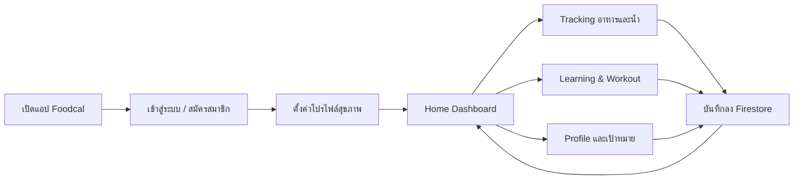
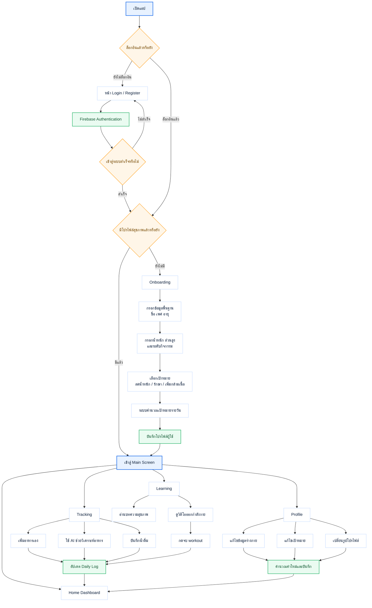
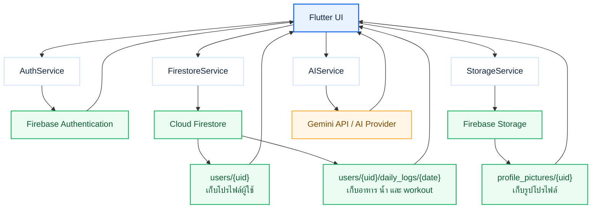
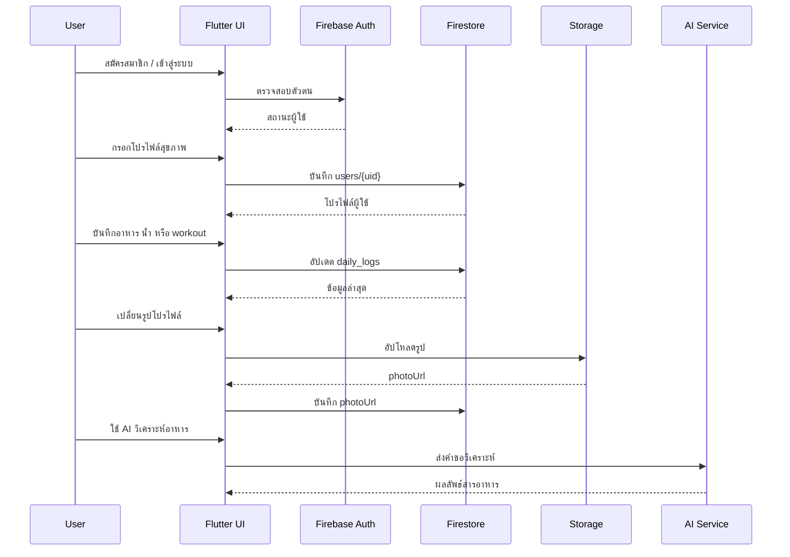

# Foodcal App Flow

ไฟล์นี้ใช้เป็นเวอร์ชันสำหรับสไลด์พรีเซนต์ โดยแยกเป็น `User Flow` และ `System Flow` เพื่ออธิบายทั้งมุมผู้ใช้งานและมุมการทำงานของระบบ

## 1. Overview

### ประโยคสรุปสำหรับพูด

Foodcal เป็นแอปติดตามสุขภาพที่เริ่มจากการสมัครสมาชิกและตั้งค่าโปรไฟล์สุขภาพ จากนั้นผู้ใช้สามารถบันทึกอาหาร น้ำ ออกกำลังกาย และดูความรู้สุขภาพได้ในแอปเดียว โดยข้อมูลทั้งหมดจะถูกสรุปกลับมาที่หน้า Dashboard

---

## 2. User Flow

### สิ่งที่อาจารย์ควรเห็นจาก User Flow

- ผู้ใช้เริ่มจากการยืนยันตัวตนก่อนเสมอ
- ถ้าเป็นผู้ใช้ใหม่ จะต้องผ่าน Onboarding เพื่อสร้างเป้าหมายสุขภาพเฉพาะบุคคล
- หลังจากนั้นผู้ใช้จะทำงานหลักอยู่ใน 4 หน้า คือ `Home`, `Tracking`, `Learning`, และ `Profile`
- ทุกกิจกรรมสำคัญจะเชื่อมกลับไปที่การบันทึกข้อมูลและอัปเดตหน้า Dashboard

---

## 3. System Flow

### สิ่งที่อาจารย์ควรเห็นจาก System Flow

- ฝั่งแอปพัฒนาด้วย Flutter และแยก service ตามหน้าที่ชัดเจน
- การยืนยันตัวตนใช้ `Firebase Authentication`
- ข้อมูลโปรไฟล์และบันทึกรายวันเก็บใน `Cloud Firestore`
- รูปโปรไฟล์เก็บใน `Firebase Storage`
- การวิเคราะห์อาหารเชื่อมกับ AI service แล้วส่งผลลัพธ์กลับมาแสดงในแอป

---

## 4. Data Flow แบบสั้น

---

## 5. ประโยคปิดสไลด์

Foodcal ถูกออกแบบให้ผู้ใช้เห็นภาพสุขภาพของตัวเองได้ในหนึ่งแอป ตั้งแต่การตั้งเป้าหมาย บันทึกพฤติกรรมประจำวัน เรียนรู้ข้อมูลสุขภาพ ไปจนถึงติดตามผลผ่าน Dashboard โดยมี Firebase เป็นแกนหลักในการจัดการข้อมูลและผู้ใช้
