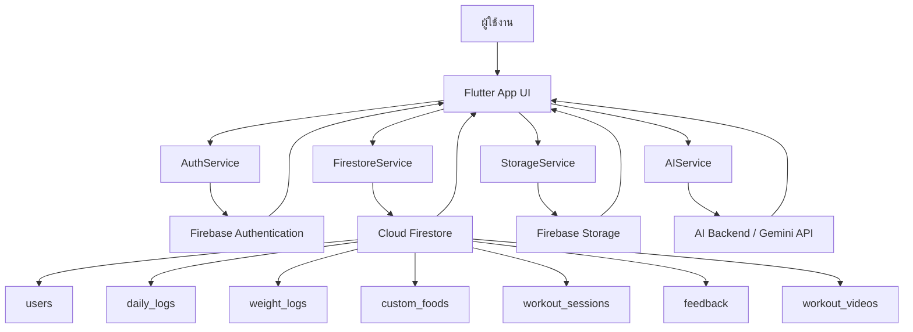
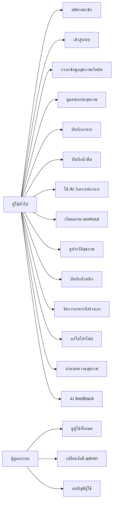
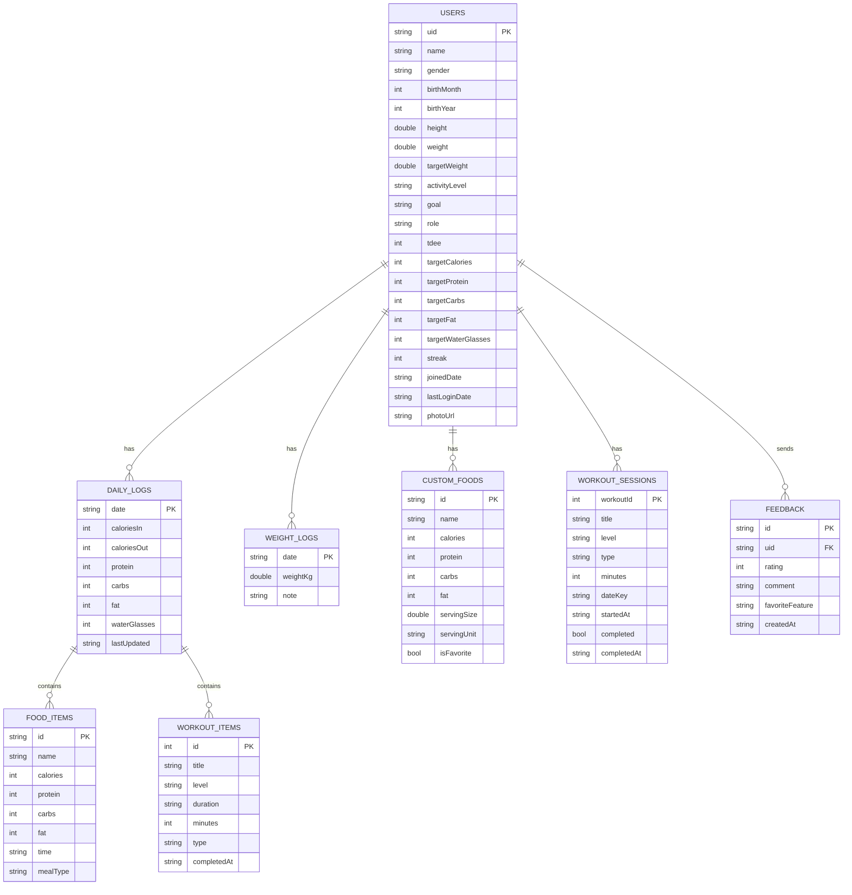
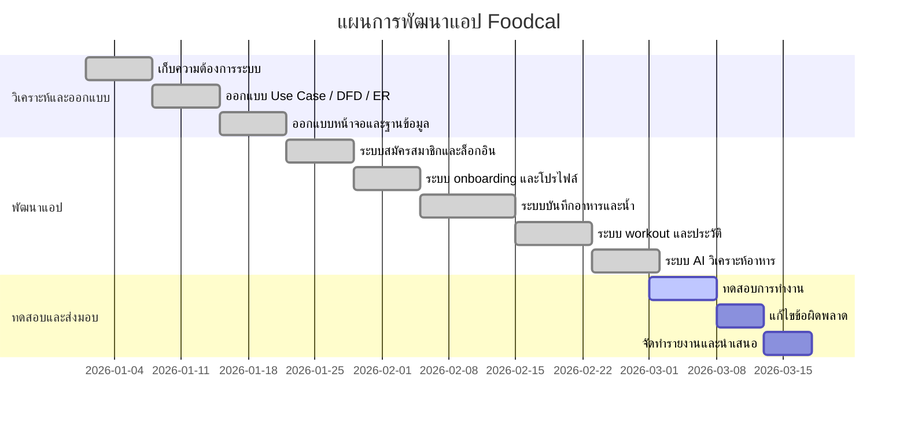

# เอกสารวิเคราะห์ระบบ Foodcal

เอกสารนี้สรุปภาพรวมของแอป Foodcal จากโค้ดปัจจุบันในโปรเจกต์ เพื่อใช้เป็นฐานสำหรับรายงาน วิชาโปรเจกต์ หรือพรีเซนต์งานระบบ

## 1. Data Flow Diagram

### คำอธิบายย่อ

- ผู้ใช้โต้ตอบผ่านแอป Flutter
- ระบบยืนยันตัวตนผ่าน Firebase Authentication
- ข้อมูลหลักเก็บใน Cloud Firestore
- รูปโปรไฟล์เก็บใน Firebase Storage
- การวิเคราะห์อาหารด้วยรูปหรือข้อความเชื่อมกับ AI backend

## 2. Use Case Diagram

## 3. Entity Relationship Diagram

หมายเหตุ: แอพนี้ใช้ Firestore ซึ่งเป็นฐานข้อมูลแบบ document จึงมีทั้งความสัมพันธ์แบบ collection/subcollection และการฝังข้อมูลบางส่วนไว้ใน document เดียว เช่น `foods` และ `workouts` ภายใน `daily_logs`

## 4. ตารางข้อมูลของระบบ

### ตารางที่ 1 `users`

| ฟิลด์ | ชนิดข้อมูล | รายละเอียด |
|---|---|---|
| `uid` | String | รหัสผู้ใช้จาก Firebase Auth |
| `name` | String | ชื่อผู้ใช้ |
| `gender` | String | เพศ |
| `birthMonth` | int | เดือนเกิด |
| `birthYear` | int | ปีเกิด |
| `height` | double | ส่วนสูง |
| `weight` | double | น้ำหนักปัจจุบัน |
| `targetWeight` | double | น้ำหนักเป้าหมาย |
| `activityLevel` | String | ระดับกิจกรรม |
| `goal` | String | เป้าหมายสุขภาพ |
| `role` | String | สิทธิ์ผู้ใช้ เช่น `user`, `admin` |
| `tdee` | int | พลังงานที่ใช้ต่อวัน |
| `targetCalories` | int | แคลอรีเป้าหมายต่อวัน |
| `targetProtein` | int | โปรตีนเป้าหมาย |
| `targetCarbs` | int | คาร์บเป้าหมาย |
| `targetFat` | int | ไขมันเป้าหมาย |
| `targetWaterGlasses` | int | เป้าหมายน้ำดื่มต่อวัน |
| `streak` | int | จำนวนวันใช้งานต่อเนื่อง |
| `joinedDate` | String/Date | วันที่เริ่มใช้งาน |
| `lastLoginDate` | String/Date | วันที่เข้าใช้งานครั้งล่าสุด |
| `photoUrl` | String | URL รูปโปรไฟล์ |

### ตารางที่ 2 `daily_logs`

ตำแหน่งจัดเก็บ: `users/{uid}/daily_logs/{date}`

| ฟิลด์ | ชนิดข้อมูล | รายละเอียด |
|---|---|---|
| `date` | String | วันที่รูปแบบ `YYYY-MM-DD` |
| `caloriesIn` | int | แคลอรีที่รับเข้า |
| `caloriesOut` | int | แคลอรีที่เผาผลาญ |
| `protein` | int | โปรตีนรวมทั้งวัน |
| `carbs` | int | คาร์บรวมทั้งวัน |
| `fat` | int | ไขมันรวมทั้งวัน |
| `waterGlasses` | int | จำนวนแก้วน้ำ |
| `foods` | Array | รายการอาหารที่บันทึก |
| `workouts` | Array | รายการออกกำลังกายที่จบแล้ว |
| `lastUpdated` | Timestamp/String | วันที่อัปเดตล่าสุด |

### ตารางที่ 3 `foods` แบบ embedded ใน `daily_logs`

| ฟิลด์ | ชนิดข้อมูล | รายละเอียด |
|---|---|---|
| `id` | String | รหัสอาหาร |
| `name` | String | ชื่ออาหาร |
| `calories` | int | แคลอรี |
| `protein` | int | โปรตีน |
| `carbs` | int | คาร์บ |
| `fat` | int | ไขมัน |
| `time` | String/Date | เวลาที่รับประทาน |
| `mealType` | String | ประเภทมื้อ เช่น breakfast, lunch, dinner, snack |

### ตารางที่ 4 `workouts` แบบ embedded ใน `daily_logs`

| ฟิลด์ | ชนิดข้อมูล | รายละเอียด |
|---|---|---|
| `id` | int | รหัส workout |
| `title` | String | ชื่อ workout |
| `level` | String | ระดับความยาก |
| `duration` | String | ระยะเวลาแบบข้อความ |
| `minutes` | int | จำนวนเวลาจริงเป็นนาที |
| `type` | String | ประเภทการออกกำลังกาย |
| `completedAt` | String/Date | เวลาที่ทำเสร็จ |

### ตารางที่ 5 `workout_sessions`

ตำแหน่งจัดเก็บ: `users/{uid}/workout_sessions/{workoutId}`

| ฟิลด์ | ชนิดข้อมูล | รายละเอียด |
|---|---|---|
| `workoutId` | int | รหัส workout |
| `title` | String | ชื่อ workout |
| `level` | String | ระดับความยาก |
| `type` | String | ประเภท workout |
| `minutes` | int | เวลาที่ต้องทำ |
| `dateKey` | String | วันที่ของ session |
| `startedAt` | String/Date | เวลาเริ่ม |
| `completed` | bool | สถานะจบหรือยัง |
| `completedAt` | String/Date | เวลาจบ |
| `updatedAt` | Timestamp | เวลาที่ระบบอัปเดต |

### ตารางที่ 6 `weight_logs`

ตำแหน่งจัดเก็บ: `users/{uid}/weight_logs/{date}`

| ฟิลด์ | ชนิดข้อมูล | รายละเอียด |
|---|---|---|
| `date` | String | วันที่บันทึก |
| `weightKg` | double | น้ำหนักเป็นกิโลกรัม |
| `note` | String | หมายเหตุเพิ่มเติม |

### ตารางที่ 7 `custom_foods`

ตำแหน่งจัดเก็บ: `users/{uid}/custom_foods/{foodId}`

| ฟิลด์ | ชนิดข้อมูล | รายละเอียด |
|---|---|---|
| `id` | String | รหัสอาหารกำหนดเอง |
| `name` | String | ชื่ออาหาร |
| `calories` | int | แคลอรี |
| `protein` | int | โปรตีน |
| `carbs` | int | คาร์บ |
| `fat` | int | ไขมัน |
| `servingSize` | double | ปริมาณต่อหนึ่งหน่วย |
| `servingUnit` | String | หน่วย เช่น g |
| `isFavorite` | bool | ถูกปักเป็นรายการโปรดหรือไม่ |

### ตารางที่ 8 `feedback`

| ฟิลด์ | ชนิดข้อมูล | รายละเอียด |
|---|---|---|
| `id` | String | รหัส feedback |
| `uid` | String | ผู้ส่ง feedback |
| `rating` | int | คะแนนความพึงพอใจ |
| `comment` | String | ความเห็นเพิ่มเติม |
| `favoriteFeature` | String | ฟีเจอร์ที่ชอบ |
| `createdAt` | Timestamp | วันเวลาที่ส่ง |

### ตารางที่ 9 `workout_videos`

| ฟิลด์ | ชนิดข้อมูล | รายละเอียด |
|---|---|---|
| `id` | int | รหัสวิดีโอ |
| `title` | String | ชื่อวิดีโอ |
| `level` | String | ระดับความยาก |
| `duration` | String | ระยะเวลา |
| `type` | String | ประเภท |
| `youtubeUrl` | String | ลิงก์ YouTube |

## 5. Gantt Chart แบบใช้นำเสนอ

ด้านล่างเป็น Gantt Chart ตัวอย่างสำหรับอธิบายขั้นตอนพัฒนา Foodcal

## 6. ข้อสังเกตสำคัญสำหรับใช้ส่งงาน

- ถ้าจะเขียนรายงานเชิงฐานข้อมูลแบบ relational สามารถอธิบายได้ว่า `daily_logs` เป็น entity หลัก และมี `foods` กับ `workouts` เป็น child records
- แต่ถ้าจะเขียนให้ตรงกับของจริงที่สุด ควรระบุว่าแอพนี้ใช้ Firestore ซึ่งรองรับ nested array และ subcollection
- โครงสร้างที่มีในโค้ดปัจจุบัน ไม่ได้แยก `Meal`, `ConsumedFood`, `Food`, `Exercise`, `WorkoutLog` ตาม relational database แบบเข้มงวด แต่ใช้ `daily_logs`, `foods`, `workouts`, `workout_sessions`, `custom_foods` แทน

## 7. สิ่งที่สามารถทำต่อให้ได้

- ปรับเอกสารนี้ให้เป็นรูปแบบอาจารย์ต้องการ
- แยกเป็นไฟล์ `Data Flow Diagram`, `Use Case Diagram`, `ER Diagram` คนละไฟล์
- แปลงตารางให้เป็นรูปแบบบทที่ 3 หรือบทที่ 4 ของรายงาน
- ทำเวอร์ชันภาษาอังกฤษ
- ทำสไลด์สรุปจากเอกสารนี้ต่อได้
